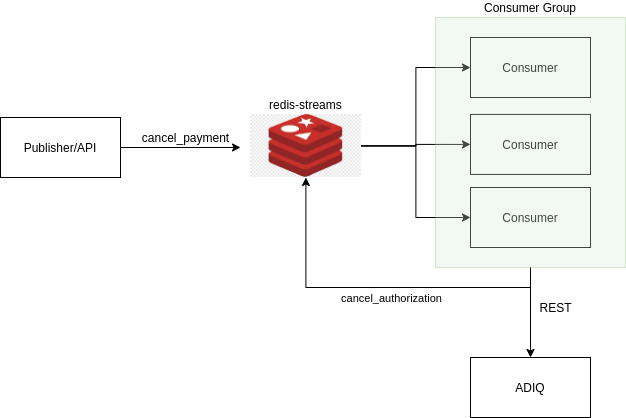

# springboot-redis-streams
Aplicação em Springboot utilizando redis-streams

## Arquitetura

Para o cenário proposto foi escolhida a arquitetura utilizando a funcionalidade de streams do redis. As razões pela escolha dessa arquitetura são:
- Escalabilidade: A qualquer momento é possível escalar de forma individual tanto o Producer/API quanto o Consumer.

- Histórico: Todas as mensagens recebidas ficam armazenadas possibilitando ter um histórico de todas as operações feitas.

- Disponibilidade: Se o consumer estiver indisponível no momento em que a mensagem chega o consumer poderá consumi-la assim que ficar disponível.

### Redis Streams vs Publisher/Subscribe

| Pub/Sub                                                                              	| Stream                                                                                                                    	|
|--------------------------------------------------------------------------------------	|---------------------------------------------------------------------------------------------------------------------------	|
| Não persistente                                                                      	| Persistente                                                                                                               	|
| Modelo fire & forget. Para receber a mensagem o  recebedor precisa estar executando. 	| Os consumers não precisam estar rodando quando a mensagem chega. Podem consumir as mensagens assim que estiver operando.  	|
| Todos os subscribers recebem a mesma mensagem                                        	| Somente um consumer dentro de consumer group receberá a mensagem. Evitando assim o processamento de mensagens duplicadas. 	|

### Solicitar Pagamento

- Nessa arquitetura um `client` faz uma requisição `REST` para a `API` solicitando um pagamento, a `API` publica esse evento no `Redis`.
- Um `consumer` do grupo de `consumers` processará esse evento chamando a `API` da `ADIQ` e a resposta gerará um novo evento `payment_authorization` que será publicado no `Redis`. O `client` então poderá consumir esses eventos para obtrem a resposta da chamada (não implementado). O `consumer` do evento `solicitar pagamento` poderia armazenar essas informações em uma base de dados noSQL ou em uma base relacional (não implementado). 

### Cancelar Pagamento

- O `cancelar pagamento` segue a mesma arquitetura do `solicitar pagamento`

## Execução com Docker

- Prerequisitos

  - `Java JDK 11`
  - `Docker`
  - `Docker Compose`
  
  ### Execução do redis e redis-commander
  
  Acesse a pasta do projeto
  
  `cd springboot-redis-streams`
  
  execute:
  
  `docker-compose up redis redis-commander`
  
  Acesse a instância do redis no navegador
  
  `http://localhost:8081`
  
  Criando os consumers-group que vamos utilizar, execute no console do redis-commander:
  
  `XGROUP CREATE request_payment_stream request_payment_stream $ MKSTREAM`
  
  `XGROUP CREATE cancel_payment_stream cancel_payment_stream $ MKSTREAM`
  
  ### Execução do Producer
  
  Acesse a pasta do projeto

  `cd springboot-redis-streams/springboot-redis-producer`
  
  Execute o maven para buildar o projeto

  `mvn clean install`

  Execute o build do Dockerfile

  `docker build -t icaro/redis-producer .`
  
  Navegue para a raiz do projeto
  
  `cd ..`
  
  Inicializa o producer
  
  `docker-compose up producer`
  
    ### Execução do Consumer
  
  Acesse a pasta do projeto

  `cd springboot-redis-streams/springboot-redis-consumer`
  
  Execute o maven para buildar o projeto

  `mvn clean install`

  Execute o build do Dockerfile

  `docker build -t icaro/redis-consumer .`
  
  Navegue para a raiz do projeto
  
  `cd ..`
  
  Inicializa o consumer
  
  `docker-compose up consumer`
  
